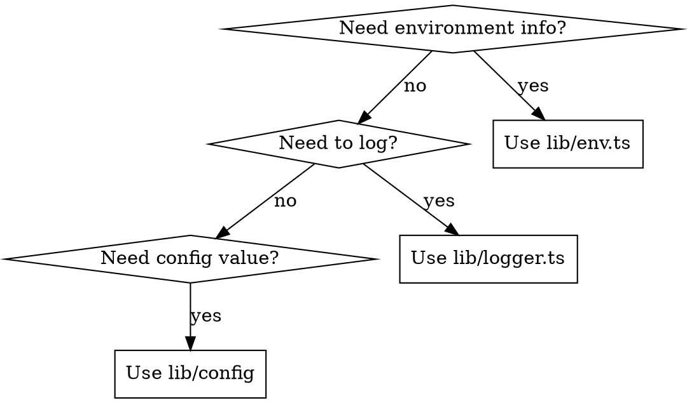

# Using Utilities

## Overview

This codebase has three interconnected utilities for environment-aware development:
- **lib/env.ts** - Environment detection (dev/test/prod/build)
- **lib/logger.ts** - Environment-aware logging
- **lib/config/index.ts** - Feature flags, security settings, defaults

**Core principle:** Never use `process.env.NODE_ENV` directly. Use these utilities for consistent environment handling.

## Quick Reference

### Environment Detection (lib/env.ts)

| Function | Returns `true` when |
|----------|---------------------|
| `isDevelopment()` | `NODE_ENV === "development"` |
| `isProduction()` | `NODE_ENV === "production"` |
| `isTestMode()` | `NODE_ENV === "test"` OR `NEXT_PUBLIC_PLAYWRIGHT_TEST === "true"` |
| `isBuildTime()` | `NEXT_PHASE === "phase-production-build"` |

```tsx
import { isDevelopment, isTestMode } from "@/lib/env"

// Skip operations during tests
if (!isTestMode()) {
  await sendEmail(user.email)
}

// Dev-only features
if (isDevelopment()) {
  console.log("Debug info:", data)
}
```

### Logger (lib/logger.ts)

See the dedicated `using-logger` skill for full details. Key rule: never use `console.log/warn/error` directly — always use `logger` from `@/lib/logger`.

### Config (lib/config/index.ts)

```tsx
import { features, security, logging } from "@/lib/config"

// Feature flags
if (features.skipEmailInTest) {
  return // Skip email in tests
}

// Security settings
const cookieOptions = {
  secure: security.secureCookies,  // true in prod, false in dev
}

// Logging config
if (logging.logRequests) {
  logger.request("GET", "/api/users")
}
```

## When to Use What



## Common Mistakes

| Mistake | Fix |
|---------|-----|
| `process.env.NODE_ENV === "development"` | Use `isDevelopment()` from lib/env.ts |
| `console.log()` for debugging | Use `logger.debug()` - respects log level |
| Hardcoding dev/prod differences | Add to lib/config features or security |
| Using `logger.info()` for errors | Use `logger.error()` - always shown in prod |

## Adding New Config

To add environment-specific configuration:

```tsx
// In lib/config/index.ts
export const myFeature = {
  enabled: isDevelopment(),
  maxItems: isProduction() ? 100 : 10,
} as const
```
